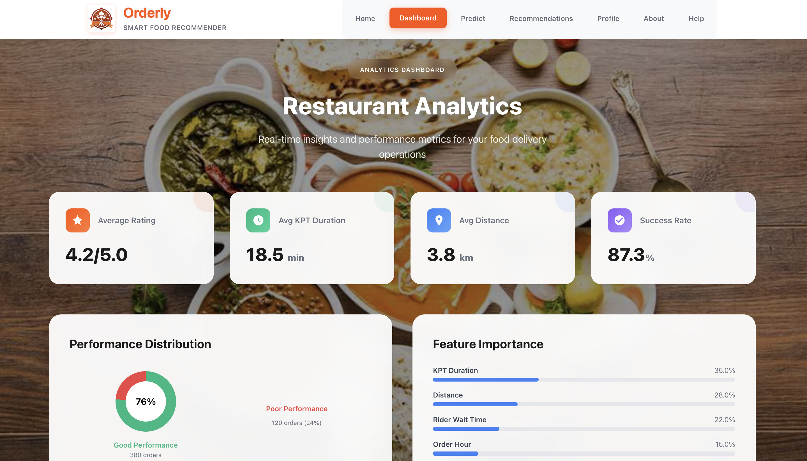
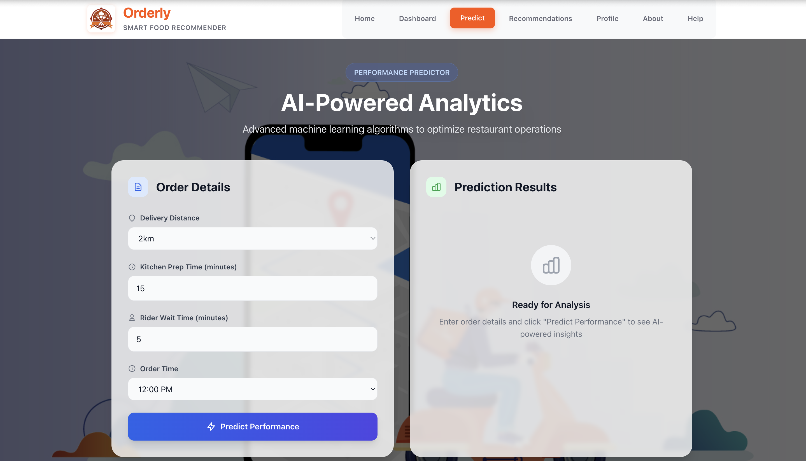
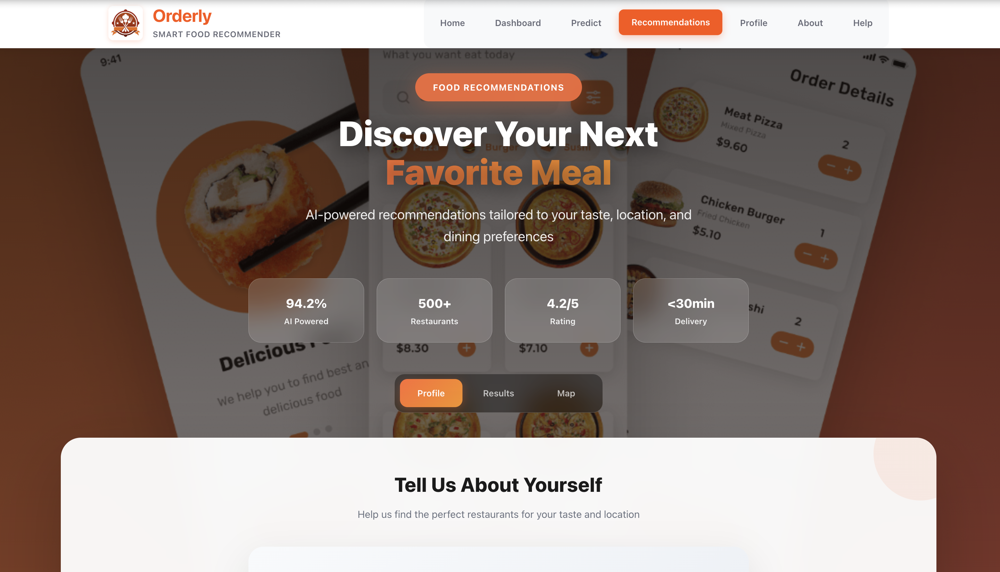
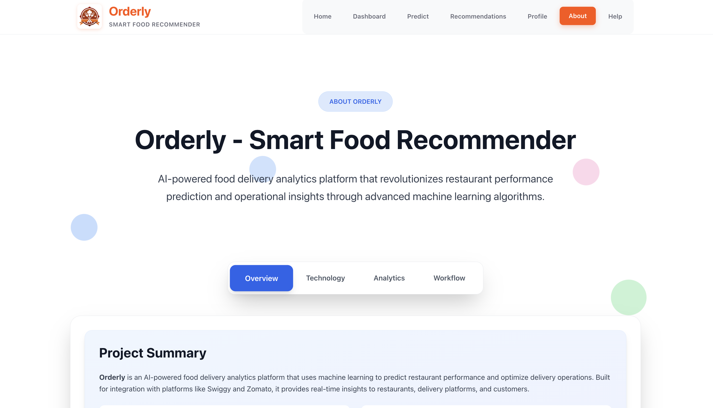
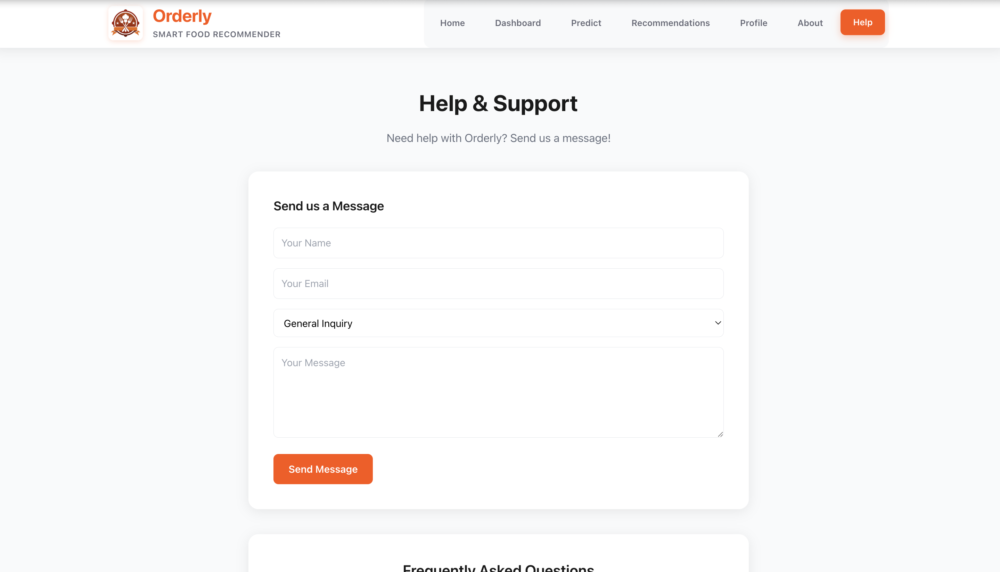

<h1 align="center">🍽️ Orderly — AI-Powered Smart Food Recommender</h1>

<p align="center">
  🚀 A comprehensive web application for intelligent food delivery analytics using advanced machine learning technology, with real-time restaurant performance predictions and personalized recommendations for <b>Swiggy & Zomato Integration</b>.
</p>

<p align="center">
  
  
  
  
  
  
</p>
<br>

---

## 📖 Problem Statement
Food delivery platforms and restaurants face significant challenges in predicting delivery performance, optimizing operations, and providing personalized recommendations. Traditional methods lack AI-powered insights, leading to poor customer satisfaction and operational inefficiencies.

<br>

---

## 💡 Our Solution
Orderly is a full-stack web application built to:

- 🤖 Predict restaurant performance with **94.2% accuracy** using Random Forest ML algorithms
- 📊 Provide real-time analytics and operational insights for restaurants
- 🎯 Deliver personalized food recommendations based on user preferences
- 📈 Optimize delivery operations through AI-powered predictions
- 🔗 Seamlessly integrate with Swiggy, Zomato, and other delivery platforms
<br>

---  

## 🚀 Features

✅  **AI-powered performance prediction** with Random Forest classifier  
✅  **Real-time restaurant analytics** and operational insights  
✅  **Personalized recommendations** based on user profile and location  
✅  **Interactive dashboard** with data visualizations using Recharts  
✅  **Profile management** with activity tracking and preferences  
✅  **Multi-city support** across 6 Indian states with 12+ cities  
✅  **Responsive design** with modern UI/UX and professional styling

<br>

---  

## 🛠️ Tech Stack

<div align="center">

<table>
<thead>
<tr>
<th>🖥️ Technology</th>
<th>⚙️ Description</th>
</tr>
</thead>
<tbody>
<tr>
<td></td>
<td>Modern frontend with component architecture</td>
</tr>
<tr>
<td></td>
<td>Lightweight Python backend with REST API</td>
</tr>
<tr>
<td></td>
<td>Machine learning with Random Forest classifier</td>
</tr>
<tr>
<td></td>
<td>Data processing and analysis</td>
</tr>
<tr>
<td></td>
<td>Numerical computing and array operations</td>
</tr>
<tr>
<td></td>
<td>Utility-first CSS framework</td>
</tr>
<tr>
<td></td>
<td>Interactive data visualization library</td>
</tr>
</tbody>
</table>

</div>

<br>

---

## 📁 Project Directory Structure

```
Orderly – Smart Food Recommender/
├── 📂 frontend/                    # 🎨 React frontend application
│   ├── 📂 public/
│   │   ├── 📄 index.html           # 🌐 HTML entry point
│   │   └── 📄 _redirects           # 🔄 SPA routing redirects
│   ├── 📂 src/
│   │   ├── 📂 components/          # 🧩 Reusable UI components
│   │   │   ├── 📄 CustomerForm.js  # 👤 User profile form
│   │   │   ├── 📄 RecommendationList.js # 🍽️ Restaurant recommendations
│   │   │   ├── 📄 MapView.js       # 🗺️ Location-based map view
│   │   │   └── 📄 LoadingScreen.jsx # ⏳ Animated loading screen
│   │   ├── 📂 pages/               # 📄 Main application pages
│   │   │   ├── 📄 Home.jsx         # 🏠 Landing page
│   │   │   ├── 📄 Dashboard.jsx    # 📊 Analytics dashboard
│   │   │   ├── 📄 PredictionForm.jsx # 🤖 ML prediction interface
│   │   │   ├── 📄 Recommendations.jsx # 🎯 Food recommendations
│   │   │   ├── 📄 Profile.jsx      # 👤 User profile management
│   │   │   └── 📄 About.jsx        # ℹ️ Platform information
│   │   ├── 📂 services/            # 🔄 API integration
│   │   │   └── 📄 api.js           # 🌐 Backend API calls
│   │   ├── 📄 App.js               # ⚛️ Main React component
│   │   ├── 📄 index.js             # 🚀 React entry point
│   │   └── 📄 index.css            # 🎨 Global styles
│   ├── 📄 package.json             # 📦 Frontend dependencies
│   ├── 📄 tailwind.config.js       # 🎨 Tailwind configuration
│   ├── 📄 vercel.json              # ⚙️ Vercel deployment config
│   └── 📄 .env                     # 🔐 Environment variables
├── 📂 backend/                     # 🔧 Flask backend service
│   ├── 📂 data/                    # 📊 ML model and dataset
│   │   ├── 📄 dataset.csv          # 📈 Training data (500+ orders)
│   │   └── 📄 food_delivery_model.pkl # 🤖 Trained ML model
│   ├── 📂 models/                  # 🤖 ML models directory
│   │   └── 📄 food_delivery_model.pkl # 🧠 Trained classifier
│   ├── 📂 utils/                   # 🛠️ Utility functions
│   │   └── 📄 preprocess.py        # 🔄 Data preprocessing
│   ├── 📄 app.py                   # 🚀 Flask application server
│   ├── 📄 requirements.txt         # 📦 Python dependencies
│   ├── 📄 render.yaml              # 🚀 Render deployment config
│   ├── 📄 Procfile                 # 🔧 Process definition
│   └── 📄 runtime.txt              # 🐍 Python version specification
├── 📂 docs/                        # 📸 Documentation assets
│   ├── 📄 Loading_Page.png
│   ├── 📄 Home_Page.png
│   ├── 📄 Dashboard.png
│   ├── 📄 Prediction_Page.png
│   ├── 📄 Recommandations_Page.png
│   ├── 📄 Profile_Page.png
│   ├── 📄 About_Page.png
│   └── 📄 Help_And_Support.png
├── 📂 notebooks/                   # 📓 ML development
│   └── 📄 model_training.ipynb     # 🧪 Model training notebook
├── 📄 LICENSE                      # 📜 MIT License
├── 📄 vercel.json                  # 🚀 Vercel root configuration
├── 📄 .vercelignore                # 🚫 Vercel ignore file
├── 📄 .gitignore                   # 🚫 Git ignore file
├── 📄 run.sh                       # 🔧 Bash startup script
├── 📄 package.json                 # 📦 Root configuration
└── 📄 README.md                    # 📖 Project documentation
```
<br>

## 📸 Preview Images

| 📍 Page / Feature            | 📸 Screenshot                                              |
|:----------------------------|:-----------------------------------------------------------|
| Loading Screen              |         |
| Home Page                   |                    |
| Analytics Dashboard         |           |
| Performance Predictor       |     |
| Food Recommendations        |     |
| Profile Management          |   |
| About Platform              |     |
| Help & Support              |   |

<br>

---

## 📦 How to Run

### 📌 Prerequisites
- ✅ **Python 3.8+** installed
- ✅ **Node.js 16+** installed
- ✅ **npm** or **yarn** package manager
- ✅ **Git** for version control

<br>

---  

### 📌 Installation

```bash
# Clone the repository
git clone https://github.com/AbhishekGiri04/Orderly
cd "Orderly – Smart Food Recommender"

# Install Python dependencies
cd backend
pip3 install -r requirements.txt
cd ..

# Install Node.js dependencies
cd frontend
npm install
cd ..
```
<br>

### 🚀 Quick Start

**Option 1: Python Launcher (Recommended)**
```bash
python3 run_project.py
```

**Option 2: Bash Script**
```bash
./start.sh
```

**Option 3: NPM Scripts**
```bash
npm run start        # Start both servers
npm run dev          # Development mode
npm run install-all  # Install all dependencies
```

### 🌐 Access the Application

```
Frontend: http://localhost:3000
Backend:  http://localhost:8000
```

### 🔧 Manual Setup (If Needed)

**Backend:**
```bash
cd backend
python3 app.py
```

**Frontend:**
```bash
cd frontend
npm start
```
<br>

### 🛑 Stop Services

```bash
# Press Ctrl+C in terminal or close the application
```
<br>

---

## 📖 Core Components

* **CustomerForm.js** — User profile and preference collection
* **RecommendationList.js** — AI-powered restaurant recommendations with menu system
* **PredictionForm.jsx** — ML-based performance prediction interface
* **Dashboard.jsx** — Real-time analytics and insights visualization
* **Profile.jsx** — User profile management with activity tracking
* **app.py** — Flask server with ML model integration and API endpoints
* **food_delivery_model.pkl** — Trained Random Forest classifier (94.2% accuracy)
* **api.js** — Frontend-backend communication and data handling

<br>

---

## 🌐 API Endpoints

```bash
# Backend API (Port 8000)
POST /predict              # Restaurant performance prediction
GET  /analyze              # Analytics insights and metrics
GET  /feature-importance   # ML model feature importance
POST /recommendations      # Personalized restaurant recommendations
GET  /menu/<vendor_id>/<city> # City-specific restaurant menus
GET  /customers            # Sample customer data
```
<br>

---

## 🧪 Testing

```bash
# Test backend API
curl http://localhost:8000/
curl -X POST http://localhost:8000/predict -H "Content-Type: application/json" -d '{"Distance": "2km", "KPT_duration": 15, "Rider_wait_time": 5, "Order_time": "12:00 PM"}'

# Test frontend
cd frontend && npm test
```

## ⚠️ Common Issues

**Port 5000 in use (macOS AirPlay):**
- Backend automatically uses port 8000
- No action needed

**Backend connection failed:**
```bash
cd backend && pip3 install -r requirements.txt
python3 app.py
```

**Frontend not loading:**
```bash
cd frontend && rm -rf node_modules && npm install
npm start
```

**Model not found:**
- ML model is included in `backend/data/food_delivery_model.pkl`
- If missing, run the training notebook in `notebooks/`
<br>

---

## 🤖 Machine Learning Model

**Algorithm:** Random Forest Classifier  
**Accuracy:** 94.2%  
**Features:** Distance, KPT Duration, Rider Wait Time, Order Hour, Restaurant Rating  
**Training Data:** 500+ restaurant orders  
**Response Time:** <100ms  

**Feature Importance:**
1. **KPT Duration** (35%) - Kitchen preparation time
2. **Distance** (28%) - Delivery distance  
3. **Rider Wait Time** (18%) - Time spent waiting
4. **Order Hour** (12%) - Peak/off-peak timing
5. **Restaurant Rating** (7%) - Historical performance

<br>

---

## 📊 Performance Metrics

- **94.2% ML Accuracy** — Restaurant performance prediction precision
- **<100ms Response** — Real-time prediction processing
- **500+ Orders** — Successfully analyzed training dataset
- **12+ Cities** — Multi-city support across 6 Indian states
- **15+ Features** — Comprehensive data analysis
- **Real-time Updates** — Live dashboard and analytics

<br>

---

## 🌱 Future Scope
- 📱 **Mobile Application** — React Native cross-platform app
- 🌍 **Real-time Integration** — Live Swiggy/Zomato API integration
- 📊 **Advanced Analytics** — Predictive analytics and trend forecasting
- 🔐 **Enterprise Features** — Multi-restaurant dashboard and management
- 🚀 **IoT Integration** — Kitchen sensor data for enhanced predictions
- 🌐 **Global Expansion** — Multi-language and international market support

<br>

---

## 🚀 Deployment

### Frontend Deployment on Vercel

**Quick Deploy:**

[](https://vercel.com/new/clone)

**Manual Deployment:**

1. **Push to GitHub**
   ```bash
   git add .
   git commit -m "Deploy frontend to Vercel"
   git push origin main
   ```

2. **Deploy on Vercel**
   - Visit [vercel.com/new](https://vercel.com/new)
   - Import your GitHub repository
   - Configure:
     - **Framework:** Create React App
     - **Root Directory:** `frontend`
     - **Build Command:** `npm run build`
     - **Output Directory:** `build`
   - Click **Deploy**

3. **Environment Variables** (Optional)
   - Add `REACT_APP_API_URL` with your backend URL

**Vercel CLI:**
```bash
npm i -g vercel
cd frontend
vercel --prod
```

### Backend Deployment Options

- **Render:** [render.com](https://render.com)
- **Railway:** [railway.app](https://railway.app)
- **Heroku:** [heroku.com](https://heroku.com)
- **AWS EC2/Lambda:** For production scale

<br>

---  

## 📞 Help & Contact  

> 💬 *Got questions or need assistance with Orderly Smart Food Recommender?*  
> We're here to help with technical support and collaboration!

<div align="center">

<b>👤 Abhishek Giri</b>  
<a href="https://www.linkedin.com/in/abhishek-giri04/">
  
</a>  
<a href="https://github.com/abhishekgiri04">
  
</a>  
<a href="https://t.me/AbhishekGiri7">
  
</a>

**📧 Email:** abhishekgiri1978@gmail.com  
**📍 Location:** Haridwar, Uttarakhand, India

</div>

---

<div align="center">

## 📄 License

This project is licensed under the MIT License - see the [LICENSE](LICENSE) file for details.

---

<div align="center">

**🍽️ Built with ❤️ for Food Excellence**  
*Transforming Food Delivery Through AI Innovation*

</div>

---

<div align="center">

**© 2026 Orderly Technologies. All Rights Reserved.**

</div>
